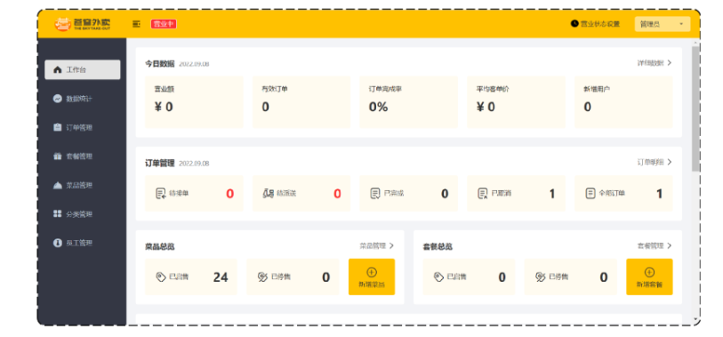
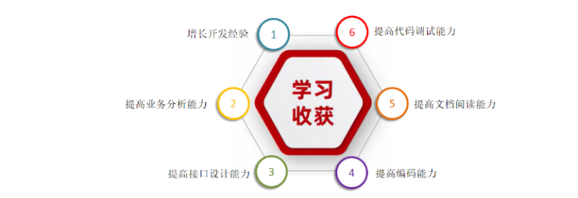

**基础项目：黑马程序员-苍穹外卖项目**

# 校园外卖点单与后台管理系统 v1.0

## 1.- 产品展示

**项目整体效果展示：**

- **管理端-外卖商家使用**

- **用户端-点餐用户使用**

当我们完成该项目的学习，可以培养以下能力：

## 2.项目介绍

本项目是专门为餐饮企业（餐厅、饭店）定制的一款软件产品，包括 系统管理后台 和 小程序端应用 两部分。其中系统管理后台主要提供给餐饮企业内部员工使用，可以对餐厅的分类、菜品、套餐、订单、员工等进行管理维护，对餐厅的各类数据进行统计，同时也可进行来单语音播报功能。小程序端主要提供给消费者使用，可以在线浏览菜品、添加购物车、下单、支付、催单等。

接下来，通过功能架构图来展示**管理端**和**用户端**的具体业务功能模块。

### 2.1 项目介绍 - 功能栈

**1). 管理端功能**

员工登录/退出 , 员工信息管理 , 分类管理 , 菜品管理 , 套餐管理 , 菜品口味管理 , 订单管理 ，数据统计，来单提醒。

餐饮企业内部员工使用。 主要功能有:

| 模块      | 描述                                                         |
| --------- | ------------------------------------------------------------ |
| 登录/退出 | 内部员工必须登录后,才可以访问系统管理后台                    |
| 员工管理  | 管理员可以在系统后台对员工信息进行管理，包含查询、新增、编辑、禁用等功能 |
| 分类管理  | 主要对当前餐厅经营的 菜品分类 或 套餐分类 进行管理维护， 包含查询、新增、修改、删除等功能 |
| 菜品管理  | 主要维护各个分类下的菜品信息，包含查询、新增、修改、删除、启售、停售等功能 |
| 套餐管理  | 主要维护当前餐厅中的套餐信息，包含查询、新增、修改、删除、启售、停售等功能 |
| 订单管理  | 主要维护用户在移动端下的订单信息，包含查询、取消、派送、完成，以及订单报表下载等功能 |
| 数据统计  | 主要完成对餐厅的各类数据统计，如营业额、用户数量、订单等     |

**2). 用户端功能**

微信登录 , 收件人地址管理 , 用户历史订单查询 , 菜品规格查询 , 购物车功能 , 下单 , 支付、分类及菜品浏览。

移动端应用主要提供给消费者使用。主要功能有:

| 模块        | 描述                                                         |
| ----------- | ------------------------------------------------------------ |
| 登录/退出   | 用户需要通过微信授权后登录使用小程序进行点餐                 |
| 点餐-菜单   | 在点餐界面需要展示出菜品分类/套餐分类, 并根据当前选择的分类加载其中的菜品信息, 供用户查询选择 |
| 点餐-购物车 | 用户选中的菜品就会加入用户的购物车, 主要包含 查询购物车、加入购物车、删除购物车、清空购物车等功能 |
| 订单支付    | 用户选完菜品/套餐后, 可以对购物车菜品进行结算支付, 这时就需要进行订单的支付 |
| 个人信息    | 在个人中心页面中会展示当前用户的基本信息, 用户可以管理收货地址, 也可以查询历史订单数据 |

### 2.2 项目介绍 - 产品原型

**产品原型**，用于展示项目的业务功能，一般由产品经理进行设计。

> **注意事项：** 产品原型主要用于展示项目的功能，并不是最终的页面效果。

在课程资料的产品原型文件夹下,提供了两份产品原型。

**管理端原型图：**

**用户端原型图：**

### 2.3 项目介绍 - 技术架构

关于本项目的技术选型, 我们将会从 用户层、网关层、应用层、数据层 这几个方面进行介绍，主要用于展示项目中使用到的技术框架和中间件等。

**1). 用户层**

本项目中在构建系统管理后台的前端页面，我们会用到H5、Vue.js、ElementUI、apache echarts(展示图表)等技术。而在构建移动端应用时，我们会使用到微信小程序。

**2). 网关层**

Nginx是一个服务器，主要用来作为Http服务器，部署静态资源，访问性能高。在Nginx中还有两个比较重要的作用： 反向代理和负载均衡， 在进行项目部署时，要实现Tomcat的负载均衡，就可以通过Nginx来实现。

**3). 应用层**

SpringBoot： 快速构建Spring项目, 采用 "约定优于配置" 的思想, 简化Spring项目的配置开发。

SpringMVC：SpringMVC是spring框架的一个模块，springmvc和spring无需通过中间整合层进行整合，可以无缝集成。

Spring Task:  由Spring提供的定时任务框架。

httpclient:  主要实现了对http请求的发送。

Spring Cache:  由Spring提供的数据缓存框架

JWT:  用于对应用程序上的用户进行身份验证的标记。

阿里云OSS:  对象存储服务，在项目中主要存储文件，如图片等。

Swagger： 可以自动的帮助开发人员生成接口文档，并对接口进行测试。

POI:  封装了对Excel表格的常用操作。

WebSocket: 一种通信网络协议，使客户端和服务器之间的数据交换更加简单，用于项目的来单、催单功能实现。

**4). 数据层**

MySQL： 关系型数据库, 本项目的核心业务数据都会采用MySQL进行存储。

Redis： 基于key-value格式存储的内存数据库, 访问速度快, 经常使用它做缓存。

Mybatis： 本项目持久层将会使用Mybatis开发。

pagehelper:  分页插件。

spring data redis:  简化java代码操作Redis的API。

**5). 工具**

git: 版本控制工具, 在团队协作中, 使用该工具对项目中的代码进行管理。

maven: 项目构建工具。

junit：单元测试工具，开发人员功能实现完毕后，需要通过junit对功能进行单元测试。

postman:  接口测工具，模拟用户发起的各类HTTP请求，获取对应的响应结果。

## 3.苍穹外卖 -  环境搭建

开发环境搭建主要包含**前端环境**和**后端环境**两部分。作为服务端开发工程师， 我们课程学习的重心应该放在后端的业务代码上， 前端的页面我们只需要导入资料中的nginx， 前端页面的代码我们只需要能看懂即可。

### 3.1 环境搭建 - 前端 Nginx

**1). 前端工程基于 nginx**

从苍穹外卖课程资料中找到前端运行环境的nginx，移动到**非中文目录**下。

**sky**目录中存放了管理端的前端资源，具体如下：

**2). 启动nginx，访问测试**

双击 nginx.exe 即可启动 nginx 服务，访问端口号为 80

http://localhost:80

### 3.2 环境搭建 - 后端

后端工程基于 maven 进行项目构建，并且进行分模块开发。

**1). 从当天资料中找到后端初始工程：**

**2). 用 IDEA 打开初始工程，了解项目的整体结构：**

对工程的每个模块作用说明：

| **序号** | **名称**          | **说明**                                                     |
| -------- |-----------------| ------------------------------------------------------------ |
| 1        | campus-take-out | maven父工程，统一管理依赖版本，聚合其他子模块                |
| 2        | common      | 子模块，存放公共类，例如：工具类、常量类、异常类等           |
| 3        | pojo        | 子模块，存放实体类、VO、DTO等                                |
| 4        | server      | 子模块，后端服务，存放配置文件、Controller、Service、Mapper等 |

对项目整体结构了解后，接下来我们详细分析上述的每个子模块：

- **common:** 模块中存放的是一些公共类，可以供其他模块使用

分析common模块的每个包的作用：

| 名称        | 说明                           |
| ----------- | ------------------------------ |
| constant    | 存放相关常量类                 |
| context     | 存放上下文类                   |
| enumeration | 项目的枚举类存储               |
| exception   | 存放自定义异常类               |
| json        | 处理json转换的类               |
| properties  | 存放SpringBoot相关的配置属性类 |
| result      | 返回结果类的封装               |
| utils       | 常用工具类                     |

- **pojo:** 模块中存放的是一些 entity、DTO、VO

分析pojo模块的每个包的作用：

| **名称** | **说明**                                     |
| -------- | -------------------------------------------- |
| Entity   | 实体，通常和数据库中的表对应                 |
| DTO      | 数据传输对象，通常用于程序中各层之间传递数据 |
| VO       | 视图对象，为前端展示数据提供的对象           |
| POJO     | 普通Java对象，只有属性和对应的getter和setter |

- **server:** 模块中存放的是 配置文件、配置类、拦截器、controller、service、mapper、启动类等

- 分析server模块的每个包的作用：

  | 名称                | 说明             |
    |-------------------| ---------------- |
  | config            | 存放配置类       |
  | controller        | 存放controller类 |
  | interceptor       | 存放拦截器类     |
  | mapper            | 存放mapper接口   |
  | service           | 存放service类    |
  | ServerApplication | 启动类           |

